<div align="center">
  
  <h3 align="center">Awesome AGV</h3>

  <p align="center">
    A rugged, high-quality configuration suite for AI Agents.
    <br />
    <a href="#getting-started">Getting Started</a>
    ·
    <a href="#usage">View Rules &amp; Skills</a>
    ·
    <a href="https://github.com/irahardianto/awesome-agv/issues">Request Feature</a>
    ·
    <br />
    <br />
  </p>
</div>

<!-- ABOUT THE PROJECT -->
## About Awesome AGV

**Awesome AGV** provides a comprehensive set of standards and practices designed to elevate the capabilities of AI coding agents. It provides a suite of strict rules distilled from software engineering best practices that ensure generated code is secure, defensible, and maintainable. It also provides specialized skills that agents load on demand.

Instead of just generating code that works, the rules and skills ensure agents generate code that **survives**.

> **⚠️ Opinionated by design.** Awesome AGV ships with opinionated defaults for specific technology stacks. See [Opinionated Technology Choices](#opinionated-technology-choices) for details and how to customize.

While this configuration is originally designed for **Antigravity**, it is built on standard markdown-based context protocols that are easily portable to other AI coding tools. As a matter of fact, the original form [Technical Constitution](https://github.com/irahardianto/technical-constitution/blob/main/technical-constitution-full.md) was first created for **Gemini CLI**

You can drop this configuration into the context or custom rule settings of:

*   **Roo Code**
*   **Claude Code**
*   Any other agentic tool that supports custom system prompts or context loading.

For example, the principles of the [Rugged Software Constitution](.agents/rules/rugged-software-constitution.md) which is based on [Rugged Software Manifesto](https://ruggedsoftware.org/) are universal and will improve the output of any LLM-based coding assistant.

### Key Features

*   📏 **25 Rules** — covering security, reliability, architecture, and maintainability. Distilled to project-specific decisions only — rules encode *what overrides model defaults*, not what models already know.
*   🛠️ **60 Skills** — specialized capabilities loaded on demand: language idioms, debugging, design, testing, performance, CI/CD, and more.
*   🔄 **10 Workflows** — end-to-end development processes from research to ship, plus specialized testing pipelines.
*   🤖 **21 Agent Personas** — specialized sub-agents for multi-agent orchestration arranged in a 4-tier hierarchy.
*   🏗️ **Three-Tier Loading System** — always-on mandates + contextual principles + on-demand skills for zero-noise enforcement.

> **💡 Everything is modular.** Rules, skills, agents, and workflows work independently — you don't need everything to benefit. Use only what you need, modify anything, or build your own. It's a toolkit, not a framework.

<!-- GETTING STARTED -->
## Getting Started

To equip your AI agent with these superpowers, follow these steps.

### Prerequisites

*   An AI Coding Assistant (Antigravity, Roo Code, Cline, etc.)
*   A project where you want to enforce high standards.

### Installation

**Quick Install (recommended):**
```sh
npx awesome-agv
```

This launches an interactive installer where you choose your installation mode:

| Mode | Description |
|---|---|
| 🚀 **Default** | Install everything — the full arsenal (recommended) |
| 🎯 **Curated** | Pick your languages & frameworks. Core rules and skills always included. |
| ⚙️ **Advanced** | Full granular control over every component. |

In **Curated** and **Advanced** modes, the installer auto-detects your project's tech stack from files like `go.mod`, `Cargo.toml`, `tsconfig.json`, `pubspec.yaml`, etc. and pre-selects matching stacks.

**CLI Flags:**

| Flag | Description |
| --- | --- |
| `--stacks <list>` | Comma-separated stacks to include (**additive** with existing config) |
| `--all` | Install everything (equivalent to Default mode) |
| `--force, -f` | Replace existing `.agents/` — re-prompts from scratch |
| `--help, -h` | Show help |

### Examples

```bash
# Interactive — choose your mode
npx awesome-agv

# Non-interactive: specific stacks, core always included
npx awesome-agv --stacks go,python

# Add React to existing installation (additive)
npx awesome-agv --stacks react

# Full install, no prompts
npx awesome-agv --all --force

# CI/CD: specific stacks, no prompts
npx awesome-agv --stacks typescript,vue --force
```

**Manual Install:**

1.  Clone this repository or copy the `.agents` folder into the root of your project.
    ```sh
    cp -r /path/to/awesome-agv/.agents ./your-project-root/
    ```
2.  Ensure your AI agent is configured to read from the `.agents` directory (most well-known AI coding assistants adhere to the `.agents` convention by default, no action needed) or manually ingest the `.agents/rules/**` as part of its system prompt.

<!-- USAGE -->
## Usage

Once installed, the rules and skills in this repository become active for your agent.

### Rule Architecture

The setup uses a **three-tier loading system** to minimize noise while maximizing coverage:

| Tier | Type | Trigger | Purpose |
| --- | --- | --- | --- |
| **1** | **Mandates** | `always_on` | Non-negotiable constraints loaded in every session (security, logging, code completion, architecture). |
| **2** | **Principles** | `model_decision` | Contextual guidance activated only when working on relevant areas (e.g., database rules activate only when writing queries). |
| **3** | **Skills** | `paths:` or rule reference | Deep expertise loaded on demand — language idioms when touching source files, CI/CD when editing pipelines, testability patterns when architectural rules reference them. |

Conflicts between rules are resolved by [Rule Priority](.agents/rules/rule-priority.md) — security always wins.

### Skill Loading Design

Skills use one of three loading mechanisms, chosen by type:

| Mechanism | When used | Examples |
| --- | --- | --- |
| **`paths:` triggers** | Language-specific idiom skills | `go-idioms` loads on `**/*.go`; `vue-idioms` loads on `**/*.vue`, `**/store/**/*.ts` |
| **`name:` + `description:` only** | Cross-cutting skills loaded via rule reference | `testability-patterns` (referenced from `architectural-pattern.md`); `logging-implementation` (referenced from `logging-and-observability-mandate.md`) |
| **Both `paths:` + `name:`/`description:`** | Infrastructure/domain skills | `ci-cd` (Dockerfiles, CI configs); `feature-flags` (feature flag files) |

> **Design invariant:** Cross-cutting skills that apply to all languages (testability, logging) are never loaded via language-specific `paths:` triggers. They are always referenced from always-on rules so they load regardless of language.

### Rule Dependencies

The rules are interconnected to provide comprehensive coverage. You can explore these relationships using the **[Interactive Rule Dependency Graph](https://irahardianto.github.io/awesome-agv/rule_dependency_graph.html)**, or view the static diagram below.

```mermaid
graph TD
  accessibility_principles["accessibility-principles.md"]
  api_design_principles["api-design-principles.md"]
  architectural_pattern["architectural-pattern.md"]
  code_idioms_and_conventions["code-idioms-and-conventions.md"]
  code_organization_principles["code-organization-principles.md"]
  command_execution_principles["command-execution-principles.md"]
  concurrency_and_threading_principles["concurrency-and-threading-principles.md"]
  configuration_management_principles["configuration-management-principles.md"]
  core_design_principles["core-design-principles.md"]
  data_serialization_and_interchange_principles["data-serialization-and-interchange-principles.md"]
  database_design_principles["database-design-principles.md"]
  dependency_management_principles["dependency-management-principles.md"]
  documentation_principles["documentation-principles.md"]
  error_handling_principles["error-handling-principles.md"]
  git_workflow_principles["git-workflow-principles.md"]
  logging_and_observability_mandate["logging-and-observability-mandate.md"]
  monitoring_and_alerting_principles["monitoring-and-alerting-principles.md"]
  performance_optimization_principles["performance-optimization-principles.md"]
  project_structure["project-structure.md"]
  resources_and_memory_management_principles["resources-and-memory-management-principles.md"]
  rugged_software_constitution["rugged-software-constitution.md"]
  rule_priority["rule-priority.md"]
  security_mandate["security-mandate.md"]
  security_principles["security-principles.md"]
  testing_strategy["testing-strategy.md"]
  accessibility_principles --> core_design_principles
  accessibility_principles --> security_principles
  accessibility_principles --> testing_strategy
  api_design_principles --> data_serialization_and_interchange_principles
  api_design_principles --> error_handling_principles
  api_design_principles --> logging_and_observability_mandate
  api_design_principles --> security_mandate
  api_design_principles --> security_principles
  architectural_pattern --> code_organization_principles
  architectural_pattern --> core_design_principles
  architectural_pattern --> database_design_principles
  architectural_pattern --> project_structure
  architectural_pattern --> testing_strategy
  code_idioms_and_conventions --> rugged_software_constitution
  code_idioms_and_conventions --> core_design_principles
  code_organization_principles --> architectural_pattern
  code_organization_principles --> core_design_principles
  code_organization_principles --> project_structure
  command_execution_principles --> security_mandate
  command_execution_principles --> security_principles
  core_design_principles --> concurrency_and_threading_principles
  core_design_principles --> performance_optimization_principles
  concurrency_and_threading_principles --> error_handling_principles
  concurrency_and_threading_principles --> resources_and_memory_management_principles
  concurrency_and_threading_principles --> testing_strategy
  configuration_management_principles --> security_mandate
  configuration_management_principles --> security_principles
  core_design_principles --> accessibility_principles
  core_design_principles --> architectural_pattern
  core_design_principles --> code_organization_principles
  core_design_principles --> documentation_principles
  data_serialization_and_interchange_principles --> api_design_principles
  data_serialization_and_interchange_principles --> error_handling_principles
  data_serialization_and_interchange_principles --> security_mandate
  data_serialization_and_interchange_principles --> security_principles
  database_design_principles --> error_handling_principles
  database_design_principles --> performance_optimization_principles
  database_design_principles --> security_principles
  dependency_management_principles --> security_mandate
  dependency_management_principles --> security_principles
  documentation_principles --> code_organization_principles
  documentation_principles --> core_design_principles
  error_handling_principles --> api_design_principles
  error_handling_principles --> core_design_principles
  error_handling_principles --> logging_and_observability_mandate
  error_handling_principles --> security_mandate
  error_handling_principles --> security_principles
  error_handling_principles --> testing_strategy
  git_workflow_principles --> code_idioms_and_conventions
  git_workflow_principles --> security_mandate
  git_workflow_principles --> testing_strategy
  logging_and_observability_mandate --> api_design_principles
  logging_and_observability_mandate --> error_handling_principles
  logging_and_observability_mandate --> monitoring_and_alerting_principles
  monitoring_and_alerting_principles --> error_handling_principles
  monitoring_and_alerting_principles --> logging_and_observability_mandate
  monitoring_and_alerting_principles --> resources_and_memory_management_principles
  performance_optimization_principles --> core_design_principles
  performance_optimization_principles --> concurrency_and_threading_principles
  performance_optimization_principles --> resources_and_memory_management_principles
  project_structure --> architectural_pattern
  project_structure --> code_organization_principles
  resources_and_memory_management_principles --> core_design_principles
  resources_and_memory_management_principles --> concurrency_and_threading_principles
  resources_and_memory_management_principles --> error_handling_principles
  rugged_software_constitution --> architectural_pattern
  rugged_software_constitution --> error_handling_principles
  rugged_software_constitution --> logging_and_observability_mandate
  rugged_software_constitution --> security_mandate
  rule_priority --> architectural_pattern
  rule_priority --> code_idioms_and_conventions
  rule_priority --> logging_and_observability_mandate
  rule_priority --> rugged_software_constitution
  rule_priority --> security_mandate
  security_mandate --> security_principles
  security_principles --> api_design_principles
  security_principles --> command_execution_principles
  security_principles --> configuration_management_principles
  security_principles --> error_handling_principles
  security_principles --> logging_and_observability_mandate
  testing_strategy --> architectural_pattern
  testing_strategy --> error_handling_principles
  testing_strategy --> project_structure
```

<details>
<summary>View Dependency Graph (Mermaid)</summary>



</details>

### Comprehensive Rule Suite (25)

The rules encode **project-specific decisions that override model defaults** — not general knowledge the model already knows. Every line of a rule answers: *"What would this model get wrong without this instruction?"*

#### 🔒 Always-On Mandates (10)

Loaded in every session — non-negotiable constraints that fire regardless of what you're working on.

| Rule | What it enforces |
| --- | --- |
| **[Rugged Software Constitution](.agents/rules/rugged-software-constitution.md)** | Hostile-environment posture: refuse insecure patterns even if asked, proactively add validation, fail securely |
| **[Security Mandate](.agents/rules/security-mandate.md)** | Deny by default, trust no input, fail closed — security always wins over convenience |
| **[Rule Priority](.agents/rules/rule-priority.md)** | Conflict resolution order: Security → Rugged → Completion/Logging → Testability → Idioms → YAGNI |
| **[Logging & Observability Mandate](.agents/rules/logging-and-observability-mandate.md)** | Every operation entry point must log start/success/failure with correlationId — no exceptions |
| **[Architectural Pattern](.agents/rules/architectural-pattern.md)** | I/O isolation, pure business logic, dependency inversion — testability-first design |
| **[Code Idioms & Conventions](.agents/rules/code-idioms-and-conventions.md)** | Language-to-skill routing table + completion workflow: generate → validate → remediate → verify → deliver |
| **[Code Organization Principles](.agents/rules/code-organization-principles.md)** | Feature-based vertical slices, public API boundaries, no circular dependencies |
| **[Core Design Principles](.agents/rules/core-design-principles.md)** | Maintainability > UX; Composition > inheritance; Rule of Three for DRY; profile before parallelizing |
| **[Project Structure](.agents/rules/project-structure.md)** | Single source of truth for directory layout — organize by feature, not by layer |
| **[Documentation Principles](.agents/rules/documentation-principles.md)** | Code shows WHAT; comments explain WHY; function docs for API contracts |

#### 🎯 Contextual Principles (15)

Activated by the model only when relevant — zero overhead when not applicable.

*   **[Security Principles](.agents/rules/security-principles.md)**: Auth, authorization, input validation, cryptographic operations
*   **[Error Handling Principles](.agents/rules/error-handling-principles.md)**: Error types, recovery strategies, resource cleanup
*   **[API Design Principles](.agents/rules/api-design-principles.md)**: REST/HTTP endpoints, handlers, response formatting
*   **[Database Design Principles](.agents/rules/database-design-principles.md)**: Schemas, migrations, queries, transaction boundaries
*   **[Testing Strategy](.agents/rules/testing-strategy.md)**: Pyramid ratios, naming, co-location, test doubles
*   **[Concurrency & Threading Principles](.agents/rules/concurrency-and-threading-principles.md)**: Race prevention, deadlock avoidance, message passing
*   **[Performance Optimization Principles](.agents/rules/performance-optimization-principles.md)**: Profile-first, bottleneck identification
*   **[Configuration Management Principles](.agents/rules/configuration-management-principles.md)**: Environment variables, secrets, settings hierarchy
*   **[Monitoring & Alerting Principles](.agents/rules/monitoring-and-alerting-principles.md)**: Health checks, metrics, SLIs/SLOs
*   **[Resource Management Principles](.agents/rules/resources-and-memory-management-principles.md)**: Files, connections, locks — always clean up
*   **[Data Serialization Principles](.agents/rules/data-serialization-and-interchange-principles.md)**: JSON, Protobuf, validation at boundaries
*   **[Dependency Management Principles](.agents/rules/dependency-management-principles.md)**: Packages, pinning, license compliance
*   **[Command Execution Principles](.agents/rules/command-execution-principles.md)**: Shell commands, injection prevention, non-interactive flags
*   **[Accessibility Principles](.agents/rules/accessibility-principles.md)**: WCAG 2.1 AA, semantic HTML, keyboard navigation
*   **[Git Workflow Principles](.agents/rules/git-workflow-principles.md)**: Conventional commits, branch naming, PR hygiene

### Specialized Skills (60)

Skills are deep expertise modules loaded on demand — agents only pay the token cost when the skill is relevant.

#### 🔧 Core Engineering Skills
*   **[Debugging Protocol](.agents/skills/debugging-protocol/SKILL.md)**: Systematic hypothesis-driven approach to solving errors
*   **[Sequential Thinking](.agents/skills/sequential-thinking/SKILL.md)**: Dynamic, reflective problem-solving through iterative thought chains, adapted from [Sequential Thinking MCP Server](https://github.com/modelcontextprotocol/servers/tree/main/src/sequentialthinking)
*   **[Code Review](.agents/skills/code-review/SKILL.md)**: Structured code review protocol against the full rule set
*   **[Guardrails](.agents/skills/guardrails/SKILL.md)**: Pre-flight checklist and post-implementation self-review
*   **[ADR](.agents/skills/adr/SKILL.md)**: Architecture Decision Records — document significant decisions with context and trade-offs
*   **[Performance Optimization](.agents/skills/perf-optimization/SKILL.md)**: Profile-driven optimization (pprof, Lighthouse, bundle analysis)
*   **[Refactoring Patterns](.agents/skills/refactoring-patterns/SKILL.md)**: Code smell taxonomy, safe transformation techniques, behavior preservation
*   **[Research Methodology](.agents/skills/research-methodology/SKILL.md)**: Structured research protocol for technologies and patterns
*   **[Omni](.agents/skills/omni/SKILL.md)**: Token-efficient communication protocol — opt-in for concise output or agent-to-agent messaging

#### 🏛️ Architecture & Infrastructure Skills
*   **[Testability Patterns](.agents/skills/testability-patterns/SKILL.md)**: I/O isolation, pure logic, dependency direction — code examples across Go, TypeScript, Python, Rust, Dart. *Loaded via reference from `architectural-pattern.md`.*
*   **[Logging Implementation](.agents/skills/logging-implementation/SKILL.md)**: Structured logging patterns, log levels, per-language libraries (Go slog, pino, structlog), PII scrubbing. *Loaded via reference from `logging-and-observability-mandate.md`.*
*   **[CI/CD](.agents/skills/ci-cd/SKILL.md)**: Pipeline design, multi-stage Docker builds, image scanning, SBOM attestation, environment promotion (Level 0–2)
*   **[CI/CD GitOps & Kubernetes](.agents/skills/ci-cd/references/gitops-kubernetes.md)**: ArgoCD, Kubernetes deployment patterns — bundled with `ci-cd`
*   **[Feature Flags](.agents/skills/feature-flags/SKILL.md)**: Release flags, kill switches, experiment flags, lifecycle rules — PRD-gated, loaded only when required

#### 🧪 Testing Skills
*   **[Testing Strategy](.agents/skills/testing-strategy/SKILL.md)**: Test doubles strategy, integration test infrastructure (Testcontainers, Firebase emulator), naming conventions, test organization patterns
*   **[Mobile Testing](.agents/skills/mobile-testing/SKILL.md)**: Mobile E2E testing patterns — Flutter integration_test, Patrol, Maestro, golden testing, device matrix, and test data management

#### 🎨 Design & UI Skills
*   **[Frontend Design](.agents/skills/frontend-design/SKILL.md)**: Production-grade frontend interfaces, bold aesthetics, typography, motion
*   **[Mobile Design](.agents/skills/mobile-design/SKILL.md)**: Platform-native mobile interfaces for Flutter and React Native

#### 🔀 Multi-Agent Orchestration Skills
*   **[Convergence Loop](.agents/skills/convergence-loop/SKILL.md)**: Iterative problem solving protocol for coordinators.
*   **[Fault Recovery](.agents/skills/fault-recovery/SKILL.md)**: Structured fault tolerance and escalation ladder.
*   **[Integrity Enforcement](.agents/skills/integrity-enforcement/SKILL.md)**: Zero-tolerance compliance checking for the arbiter agent.
*   **[Parallel Dispatch](.agents/skills/parallel-dispatch/SKILL.md)**: MECE task decomposition, file ownership enforcement, DAG-based execution, and safe merge protocol for intra-domain parallel dispatch. The safety invariants that prevent merge chaos when multiple agents write in parallel. Applies recursively at every nesting depth.
*   **[Scope Decomposition](.agents/skills/scope-decomposition/SKILL.md)**: Project and mission decomposition techniques.
*   **[Audit Checklist](.agents/skills/audit-checklist/SKILL.md)**: Consolidated audit checklists for code review and verification — loaded by `/audit` workflow and multi-agent review pipelines.
*   **[Acceptance Review](.agents/skills/acceptance-review/SKILL.md)**: Spec adherence and deliverable completeness verification — ensures what was delivered matches what was requested.

#### 🌐 Language & Framework Idioms (26)

Language-specific patterns, tooling, project layout, and quality commands. Each skill auto-loads via `paths:` triggers when the agent touches files in that language.

**Core stacks (with bundled project structure references):**

| Skill | Ecosystem | Auto-loads on |
|---|---|---|
| [Go Idioms](.agents/skills/go-idioms/SKILL.md) + [layout](.agents/skills/go-idioms/references/project-structure.md) | Go stdlib, error wrapping, table-driven tests, gofumpt | `**/*.go`, `**/go.mod` |
| [TypeScript Idioms](.agents/skills/typescript-idioms/SKILL.md) + [layout](.agents/skills/typescript-idioms/references/project-structure.md) | Strict mode, type narrowing, Zod, vitest | `**/*.ts`, `**/*.tsx` |
| [Vue Idioms](.agents/skills/vue-idioms/SKILL.md) + [layout](.agents/skills/vue-idioms/references/project-structure.md) | Vue 3 Composition API, Pinia (Setup Store), composables | `**/*.vue`, `**/store/**/*.ts`, `**/*.store.ts` |
| [Flutter Idioms](.agents/skills/flutter-idioms/SKILL.md) + [layout](.agents/skills/flutter-idioms/references/project-structure.md) | Riverpod 3, freezed, go_router, const widgets | `**/*.dart`, `**/pubspec.yaml`, `**/analysis_options.yaml` |
| [Rust Idioms](.agents/skills/rust-idioms/SKILL.md) + [layout](.agents/skills/rust-idioms/references/project-structure.md) | Ownership, tokio, thiserror/anyhow, clippy pedantic | `**/*.rs`, `**/Cargo.toml` |
| [Python Idioms](.agents/skills/python-idioms/SKILL.md) + [layout](.agents/skills/python-idioms/references/project-structure.md) | Type hints, Protocols, ruff, mypy strict, pytest | `**/*.py`, `**/pyproject.toml` |

**Community language skills:**

| Skill | Ecosystem |
|---|---|
| [Angular](.agents/skills/angular-idioms/SKILL.md) + [layout](.agents/skills/angular-idioms/references/project-structure.md) | Angular components, signals, DI, RxJS |
| [Axum](.agents/skills/axum-idioms/SKILL.md) | Axum HTTP routing, extractors, Tower middleware |
| [C++](.agents/skills/cpp-idioms/SKILL.md) | Modern C++ (RAII, smart pointers, CMake) |
| [C#](.agents/skills/csharp-idioms/SKILL.md) | .NET, async/await, LINQ, records |
| [Django](.agents/skills/django-idioms/SKILL.md) | Django ORM, views, middleware |
| [.NET](.agents/skills/dotnet-idioms/SKILL.md) | ASP.NET Core, Entity Framework |
| [Elixir](.agents/skills/elixir-idioms/SKILL.md) | OTP, GenServer, supervision trees |
| [Hono](.agents/skills/hono-idioms/SKILL.md) + [layout](.agents/skills/hono-idioms/references/project-structure.md) | Hono routing, middleware, Zod validation, RPC |
| [Java](.agents/skills/java-idioms/SKILL.md) | Streams, records, sealed classes |
| [JavaScript](.agents/skills/javascript-idioms/SKILL.md) | ES2024+, async patterns, ESM |
| [Kotlin](.agents/skills/kotlin-idioms/SKILL.md) | Coroutines, sealed classes, Android |
| [Laravel](.agents/skills/laravel-idioms/SKILL.md) | Eloquent, middleware, queues |
| [Next.js](.agents/skills/nextjs-idioms/SKILL.md) + [layout](.agents/skills/nextjs-idioms/references/project-structure.md) | App Router, RSC, ISR |
| [PHP](.agents/skills/php-idioms/SKILL.md) | PHP 8+, type declarations, Composer |
| [Rails](.agents/skills/rails-idioms/SKILL.md) | ActiveRecord, conventions, RSpec |
| [React](.agents/skills/react-idioms/SKILL.md) + [layout](.agents/skills/react-idioms/references/project-structure.md) | Hooks, Suspense, Server Components |
| [Ruby](.agents/skills/ruby-idioms/SKILL.md) | Blocks, modules, metaprogramming |
| [Spring Boot](.agents/skills/spring-boot-idioms/SKILL.md) | Spring DI, JPA, WebFlux |
| [SQL](.agents/skills/sql-idioms/SKILL.md) | Query optimization, indexes, migrations |
| [Swift](.agents/skills/swift-idioms/SKILL.md) | SwiftUI, Combine, async/await |

#### 🏢 Domain Skills
*   **[API Documentation](.agents/skills/api-documentation/SKILL.md)**: OpenAPI 3.1 specs, request/response examples, versioning
*   **[Browser Automation](.agents/skills/browser-automation/SKILL.md)**: Playwright MCP-first automation for E2E testing, UI review, and Playwright MCP interactive development
*   **[Chaos Testing](.agents/skills/chaos-testing/SKILL.md)**: Controlled failure injection and resilience verification
*   **[CLI Development](.agents/skills/cli-development/SKILL.md)**: CLI tool design, argument parsing, and distribution
*   **[Data Engineering](.agents/skills/data-engineering/SKILL.md)**: ETL/ELT patterns, data quality, and orchestration
*   **[Embedded Systems](.agents/skills/embedded-systems/SKILL.md)**: Real-time patterns, RTOS, and hardware abstraction
*   **[Incident Response](.agents/skills/incident-response/SKILL.md)**: Severity classification, triage, diagnosis, and blameless postmortem
*   **[ML Engineering](.agents/skills/ml-engineering/SKILL.md)**: ML pipelines, feature engineering, model serving, and MLOps
*   **[Payment Integration](.agents/skills/payment-integration/SKILL.md)**: PCI DSS compliance, tokenization, and webhook reliability
*   **[Supply Chain Security](.agents/skills/supply-chain-security/SKILL.md)**: SBOM generation, CVE scanning, and license compliance

### Agent Personas (21)

Agent personas are specialized sub-agents designed for multi-agent orchestration. The system uses a Recursive Multi-Agent System (RMAS) with a 4-tier orchestration hierarchy. Each agent has an exclusive domain, clear boundaries, and never crosses into another agent's territory — enforcing MECE at the architecture level.

#### Layers

| Layer | Agents | Purpose |
|---|---|---|
| **L1 Strategic** | `overseer` | Program director: aligns multiple domain streams and manages cross-domain dependencies |
| **L2 Domain** | `rally-lead` | Domain coordinator: orchestrates multiple missions within a business vertical |
| **L3 Execution** | `mission-lead` | Mission manager: drives a specific feature slice to completion |
| **Compliance** | `arbiter`, `tech-lead` | Hard gate authorities: independent verification of rules, skills, and specs |
| **Research** | `scout` | Codebase exploration, pattern discovery, technology research |
| **Design** | `architect` + optional `ux-craftsman`, `database-expert`, `security-engineer` | System design, ADRs, API contracts |
| **Build** | `backend-engineer`, `frontend-engineer`, `mobile-engineer`, `database-expert`, `devops-engineer`, `technical-writer`, `test-automation-engineer`, `performance-engineer`, `refactoring-specialist` | Implementation with isolated worktrees |
| **Review** | `qa-analyst`, `security-engineer`, `ux-craftsman`, `incident-responder`, `acceptance-reviewer` | Quality gates, security audits, UX review |

See the [workflow-team](.agents/workflows/workflow-team.md) workflow for the full dispatch protocol, including recursive parallel dispatch with MECE file ownership and DAG-based execution ordering.

### Development Workflows (10)

The setup includes opinionated, end-to-end workflows that chain rules and skills into structured development processes.

#### 🏭 Feature Workflow — Single Agent (`/workflow-solo`)

A lean, single-agent pipeline with adaptive complexity routing. The agent assesses task scope, risk, and knowledge to route into one of three tracks:

| Track | When | Pipeline |
|-------|------|----------|
| **Light** | All dimensions Low (1–3 files, no breaking changes) | IMPLEMENT → VERIFY → COMMIT |
| **Standard** | Any dimension Medium/High | RESEARCH → IMPLEMENT → VERIFY → COMMIT |
| **Thorough** | Multiple dimensions High | RESEARCH → IMPLEMENT → VERIFY (full) → COMMIT |

Each phase references existing rules and skills rather than restating content — the workflow is 133 lines total. Subagent spawning is allowed but not prescribed.

#### 🤖 Multi-Agent Orchestration (`/workflow-team`)

The pipeline manager workflow for dispatching specialized sub-agents across layers. Supports parallel execution via git worktrees with MECE file ownership.

```
SCOUT → DESIGN → PRE-MORTEM → BUILD (parallel) → REVIEW (parallel) → REMEDIATE → VERIFY
```

Includes 11 workflow templates (A-K) for common scenarios: full features, bug fixes, audits, mobile features, security hardening, infrastructure, documentation sprints, incident response, and technical debt.

#### 🧪 Testing Workflows

Specialized workflows for retroactive testing improvements on existing codebases:

| Workflow | Pipeline | Purpose |
|----------|----------|---------|
| [`/test-unit`](.agents/workflows/test-unit.md) | ANALYZE → PRIORITIZE → REFACTOR → TEST → VERIFY | Coverage-gap-first unit test improvement — analyze gaps, prioritize by business risk and git churn, refactor for testability if needed |
| [`/test-integration`](.agents/workflows/test-integration.md) | AUDIT → INFRASTRUCTURE → TEST → VERIFY | Adapter audit — scan for I/O boundaries, set up Testcontainers/mocks, write contract-compliance tests |
| [`/test-e2e`](.agents/workflows/test-e2e.md) | PLAN → SETUP → AUTHOR → EXECUTE → REPORT | Platform-adaptive E2E — web (Playwright) + mobile (Flutter/Patrol/Maestro), journey-based with evidence capture |
| [`/test-scenarios`](.agents/workflows/test-scenarios.md) | INPUT → INVENTORY → ANALYZE → DERIVE → EXPAND → ORGANIZE → OUTPUT → HUMAN REVIEW | Hybrid structured derivation + mutation-informed expansion — generates prioritized test scenarios that feed into the above workflows |

#### 🔧 Specialized Workflows

| Workflow                                        | When to Use                                          |
| ----------------------------------------------- | ---------------------------------------------------- |
| [`/bugfix`](.agents/workflows/bugfix.md) | Bug fixes — from hotfixes to complex debugging sessions |
| [`/refactor`](.agents/workflows/refactor.md)   | Safely restructure code while preserving behavior    |
| [`/audit`](.agents/workflows/audit.md)         | Code review and quality inspection (no new features) |
| [`/perf-optimize`](.agents/workflows/perf-optimize.md) | Profile-driven performance optimization              |

<!-- DIRECTORY STRUCTURE -->
## Directory Structure

```
.agents/
├── agents/            # 21 agent personas (multi-agent orchestration)
│   ├── overseer.md              # L1 Strategic Director
│   ├── rally-lead.md            # L2 Domain Coordinator
│   ├── mission-lead.md          # L3 Execution Manager
│   ├── arbiter.md               # Independent compliance authority
│   ├── tech-lead.md             # Quality gate authority
│   ├── architect.md
│   ├── backend-engineer.md
│   └── ...            # 14 more specialized agents
├── rules/             # 25 rules: 10 always-on mandates + 15 contextual principles
│   │                  # Each rule = project-specific decisions only (not model knowledge)
│   ├── rugged-software-constitution.md   # always_on: hostile-environment posture
│   ├── security-mandate.md               # always_on: deny by default
│   ├── logging-and-observability-mandate.md  # always_on: all ops must log
│   ├── architectural-pattern.md          # always_on: I/O isolation, testability
│   ├── rule-priority.md                  # always_on: conflict resolution
│   └── ...            # 5 more always-on + 15 contextual principles
├── skills/            # 60 specialized skills — loaded on demand, not always
│   ├── go-idioms/               # paths: **/*.go — includes references/project-structure.md
│   ├── typescript-idioms/       # paths: **/*.ts, **/*.tsx
│   ├── vue-idioms/              # paths: **/*.vue, **/store/**/*.ts, **/*.store.ts
│   ├── flutter-idioms/          # paths: **/*.dart, **/analysis_options.yaml
│   ├── rust-idioms/             # paths: **/*.rs, **/Cargo.toml
│   ├── python-idioms/           # paths: **/*.py, **/pyproject.toml
│   ├── testability-patterns/    # reference-loaded from architectural-pattern.md
│   ├── logging-implementation/  # reference-loaded from logging-and-observability-mandate.md
│   ├── testing-strategy/        # test doubles, naming, infrastructure patterns
│   ├── mobile-testing/          # Flutter integration_test, Patrol, Maestro, golden testing
│   │   └── references/          # flutter.md, maestro.md — framework-specific details
│   ├── ci-cd/                   # paths: Dockerfile, .github/workflows/*, Jenkinsfile, ...
│   ├── feature-flags/           # paths: feature*flag*, feature*toggle* (PRD-gated)
│   ├── debugging-protocol/      # Core engineering (reference-loaded)
│   ├── code-review/
│   ├── guardrails/
│   ├── parallel-dispatch/       # Multi-agent orchestration — consolidated safety invariants
│   ├── angular-idioms/          # Community language skills (18 ecosystems)
│   ├── react-idioms/
│   ├── java-idioms/
│   ├── incident-response/       # Domain skills
│   └── ...
└── workflows/         # 10 development workflows
    ├── workflow-solo.md          # Single-agent: lean adaptive pipeline
    ├── workflow-team.md          # Multi-agent: hierarchical orchestration
    ├── test-unit.md              # Testing: unit test coverage improvement
    ├── test-integration.md       # Testing: integration test coverage
    ├── test-e2e.md               # Testing: E2E mobile & web
    ├── test-scenarios.md         # Testing: scenario generator
    ├── bugfix.md                 # Standalone: bug fixes
    ├── refactor.md               # Standalone: code restructuring
    ├── audit.md                  # Standalone: code review
    └── perf-optimize.md          # Standalone: performance tuning
```

<!-- ROADMAP -->
## Roadmap

- [x] Include more specialized skills to aid development process (60 skills shipped).
- [x] Add development workflows for structured feature delivery (10 workflows shipped).
- [x] Add language-specific idiom skills (Go, TypeScript, Vue, Flutter, Rust, Python + 18 community language skills).
- [x] Create a CLI tool for easier installation (`npx awesome-agv`).
- [x] Add multi-agent orchestration with 21 specialized agent personas in a 4-tier RMAS hierarchy.
- [x] Distill rules to decisions-only: strip generic knowledge, keep project-specific overrides (25 rules, -71% from peak).
- [x] Migrate language idioms from rules to on-demand skills — only load when relevant to the task.
- [x] Selective CLI installer — 3-tier modes (Default/Curated/Advanced) with auto-detection and manifest-driven extraction.
- [ ] Add automated validation scripts to check if an agent is following the constitution.
- [x] Publish comprehensive documentation site (GitHub Pages).

## Opinionated Technology Choices

Awesome AGV ships with **opinionated defaults** for specific technology stacks. Each stack has a dedicated idiom skill that auto-loads when touching files in that language, providing patterns, tooling, project layout, and quality commands.

| Stack            | Default Choice                                      | Idiom Skill                                                       |
| ---------------- | --------------------------------------------------- | ----------------------------------------------------------------- |
| **Backend**      | Go — vanilla stdlib, minimal deps                   | [go-idioms](.agents/skills/go-idioms/SKILL.md)                   |
| **Frontend**     | TypeScript + Vue 3 — Composition API, Pinia, Vitest | [typescript-idioms](.agents/skills/typescript-idioms/SKILL.md) + [vue-idioms](.agents/skills/vue-idioms/SKILL.md) |
| **Mobile**       | Flutter + Riverpod 3 — freezed models, go_router    | [flutter-idioms](.agents/skills/flutter-idioms/SKILL.md)         |
| **Systems**      | Rust — tokio, thiserror/anyhow, clippy pedantic     | [rust-idioms](.agents/skills/rust-idioms/SKILL.md)               |
| **Scripting/AI** | Python — ruff, mypy strict, pytest, Pydantic        | [python-idioms](.agents/skills/python-idioms/SKILL.md)           |

**Using a different framework?** The idiom skills are modular — swap or edit them to match your stack. Community language skills are available for Angular, React, Next.js, Hono, Axum, Spring Boot, Django, Laravel, Rails, and more. See the [Adapting guide](https://irahardianto.github.io/awesome-agv/adapting) for which files to change.

## Project Adaptation Guide

This setup supports different project structures:

| Project Type            | Adaptation                                                       |
| ----------------------- | ---------------------------------------------------------------- |
| **Monorepo** (default)  | Use as-is                                                        |
| **Single backend**      | Remove frontend workflows, keep backend idiom skill              |
| **Single frontend**     | Remove backend workflows, keep frontend idiom skills             |
| **Microservices**       | Adapt `project-structure.md` per service, add service mesh rules |
| **Mobile (Flutter/RN)** | Use flutter-idioms or react-idioms skill                        |

**To adapt:** Edit `project-structure.md` and the relevant idiom skill's `references/project-structure.md` to match your project layout.

<!-- CONTRIBUTING -->
## Contributing

Contributions are what make the open source community such an amazing place to learn, inspire, and create. Any contributions you make are **greatly appreciated**.

1.  Fork the Project
2.  Create your Feature Branch (`git checkout -b feature/AmazingFeature`)
3.  Commit your Changes (`git commit -m 'Add some AmazingFeature'`)
4.  Push to the Branch (`git push origin feature/AmazingFeature`)
5.  Open a Pull Request

<!-- LICENSE -->
## License

Distributed under the MIT License. See the [LICENSE](LICENSE) file for details.

---

<p align="center">
  Built with ❤️ for the Developer Community
</p>
