<div align="center">
  
  <h3 align="center">Awesome AGV</h3>

  <p align="center">
    A rugged, high-quality configuration suite for AI Agents.
    <br />
    <a href="#usage">View Rules & Skills</a>
    ·
    <a href="https://github.com/irahardianto/awesome-agv/issues">Report Bug</a>
    ·
    <a href="https://github.com/irahardianto/awesome-agv/issues">Request Feature</a>
    <br />
    <br />
  </p>
</div>

<!-- ABOUT THE PROJECT -->
## About Awesome AGV

**Awesome AGV** provides a comprehensive sets of standards and practices designed to elevate the capabilities of AI coding agents. It provides a suite of strict rules distilled from software engineering best practices that ensure generated code is secure, defensible, and maintainable. It also provides specialized skills that will help throughout software development.

Instead of just generating code that works, the rules and skills ensures agents generate code that **survives**.

> **⚠️ Opinionated by design.** Awesome AGV ships with opinionated defaults for specific technology stacks. See [Opinionated Technology Choices](#opinionated-technology-choices) for details and how to customize.

While this configuration is originally designed for **Antigravity**, it is built on standard markdown-based context protocols that are easily portable to other AI coding tools. As a matter of fact, the original form [Technical Constitution](https://github.com/irahardianto/technical-constitution/blob/main/technical-constitution-full.md) was first created for **Gemini CLI**

You can drop this configuration into the context or custom rule settings of:

*   **Roo Code**
*   **Claude Code**
*   Any other agentic tool that supports custom system prompts or context loading.

For example, the principles of the [Rugged Software Constitution](.agent/rules/rugged-software-constitution.md) which is based on [Rugged Software Manifesto](https://ruggedsoftware.org/) are universal and will improve the output of any LLM-based coding assistant.

### Key Features

*   📏 **38 Rules** — covering security, reliability, architecture, maintainability, language idioms, and DevOps.
*   🛠️ **7 Skills** — specialized capabilities for debugging, design, code review, and more.
*   🔄 **10 Workflows** — end-to-end development processes from research to ship.
*   🏗️ **Two-Tier Rule System** — always-on mandates + contextual principles for zero-noise enforcement.

> **💡 Everything is modular.** Rules and skills work independently — you don't need workflows to benefit from them. Use only what you need, modify anything, or build your own workflows. It's a toolkit, not a framework.

<!-- GETTING STARTED -->
## Getting Started

To equip your AI agent with these superpowers, follow these steps.

### Prerequisites

*   An AI Coding Assistant (Antigravity, Roo Code, Cline, etc.)
*   A project where you want to enforce high standards.

### Installation

**Quick Install (recommended):**
```sh
npx awesome-agv
```

This downloads and installs the latest `.agent/` directory into your current project. Your AI agent will automatically pick it up — no additional configuration needed.

**Options:**

| Flag           | Description                                    |
| -------------- | ---------------------------------------------- |
| `[target-dir]` | Directory to install into (default: `./`)      |
| `--force, -f`  | Overwrite existing `.agent/` without prompting |
| `--help, -h`   | Show help                                      |

### Examples

```bash
# Install into current directory
npx awesome-agv

# Install into a specific project
npx awesome-agv ./my-project

# Overwrite existing installation without prompting
npx awesome-agv --force
```

**Manual Install:**

1.  Clone this repository or copy the `.agent` folder into the root of your project.
    ```sh
    cp -r /path/to/awesome-agv/.agent ./your-project-root/
    ```
2.  Ensure your AI agent is configured to read from the `.agent` directory (most of well-known AI coding assistant are adhering to the `.agent` convention by default, no action needed) or manually ingest the `.agent/rules/**` as part of its system prompt.

<!-- USAGE -->
## Usage

Once installed, the rules and skills in this repository become active for your agent.

### Rule Architecture

The setup uses a **two-tier rule system** to minimize noise while maximizing coverage:

| Type           | Trigger          | Purpose                                                                                                                      |
| -------------- | ---------------- | ---------------------------------------------------------------------------------------------------------------------------- |
| **Mandates**   | `always_on`      | Non-negotiable constraints loaded in every session (security, logging, code completion).                                     |
| **Principles** | `model_decision` | Contextual guidance activated only when working on relevant areas (e.g., database rules activate only when writing queries). |

Conflicts between rules are resolved by [Rule Priority](.agent/rules/rule-priority.md) — security always wins.

### Rule Dependencies

The rules are highly interconnected to provide comprehensive coverage. You can explore these relationships using the **[Interactive Rule Dependency Graph](https://irahardianto.github.io/awesome-agv/rule_dependency_graph.html)**, or view the static diagram below.

```mermaid
graph TD
  accessibility_principles["accessibility-principles.md"]
  api_design_principles["api-design-principles.md"]
  architectural_pattern["architectural-pattern.md"]
  ci_cd_principles["ci-cd-principles.md"]
  code_completion_mandate["code-completion-mandate.md"]
  code_idioms_and_conventions["code-idioms-and-conventions.md"]
  code_organization_principles["code-organization-principles.md"]
  command_execution_principles["command-execution-principles.md"]
  concurrency_and_threading_mandate["concurrency-and-threading-mandate.md"]
  concurrency_and_threading_principles["concurrency-and-threading-principles.md"]
  configuration_management_principles["configuration-management-principles.md"]
  core_design_principles["core-design-principles.md"]
  data_serialization_and_interchange_principles["data-serialization-and-interchange-principles.md"]
  database_design_principles["database-design-principles.md"]
  dependency_management_principles["dependency-management-principles.md"]
  documentation_principles["documentation-principles.md"]
  error_handling_principles["error-handling-principles.md"]
  flutter_idioms_and_patterns["flutter-idioms-and-patterns.md"]
  git_workflow_principles["git-workflow-principles.md"]
  go_idioms_and_patterns["go-idioms-and-patterns.md"]
  logging_and_observability_mandate["logging-and-observability-mandate.md"]
  logging_and_observability_principles["logging-and-observability-principles.md"]
  monitoring_and_alerting_principles["monitoring-and-alerting-principles.md"]
  performance_optimization_principles["performance-optimization-principles.md"]
  project_structure_flutter_mobile["project-structure-flutter-mobile.md"]
  project_structure_go_backend["project-structure-go-backend.md"]
  project_structure_rust_cargo["project-structure-rust-cargo.md"]
  project_structure_vue_frontend["project-structure-vue-frontend.md"]
  project_structure["project-structure.md"]
  resources_and_memory_management_principles["resources-and-memory-management-principles.md"]
  rugged_software_constitution["rugged-software-constitution.md"]
  rule_priority["rule-priority.md"]
  rust_idioms_and_patterns["rust-idioms-and-patterns.md"]
  security_mandate["security-mandate.md"]
  security_principles["security-principles.md"]
  testing_strategy["testing-strategy.md"]
  typescript_idioms_and_patterns["typescript-idioms-and-patterns.md"]
  vue_idioms_and_patterns["vue-idioms-and-patterns.md"]
  accessibility_principles --> core_design_principles
  accessibility_principles --> security_principles
  accessibility_principles --> testing_strategy
  api_design_principles --> data_serialization_and_interchange_principles
  api_design_principles --> error_handling_principles
  api_design_principles --> logging_and_observability_mandate
  api_design_principles --> security_mandate
  api_design_principles --> security_principles
  architectural_pattern --> code_organization_principles
  architectural_pattern --> core_design_principles
  architectural_pattern --> database_design_principles
  architectural_pattern --> project_structure
  architectural_pattern --> testing_strategy
  ci_cd_principles --> code_completion_mandate
  ci_cd_principles --> git_workflow_principles
  ci_cd_principles --> project_structure
  ci_cd_principles --> security_mandate
  ci_cd_principles --> testing_strategy
  code_completion_mandate --> code_idioms_and_conventions
  code_completion_mandate --> flutter_idioms_and_patterns
  code_completion_mandate --> go_idioms_and_patterns
  code_completion_mandate --> rugged_software_constitution
  code_completion_mandate --> rust_idioms_and_patterns
  code_completion_mandate --> typescript_idioms_and_patterns
  code_completion_mandate --> vue_idioms_and_patterns
  code_idioms_and_conventions --> code_completion_mandate
  code_idioms_and_conventions --> core_design_principles
  code_idioms_and_conventions --> flutter_idioms_and_patterns
  code_idioms_and_conventions --> go_idioms_and_patterns
  code_idioms_and_conventions --> rust_idioms_and_patterns
  code_idioms_and_conventions --> typescript_idioms_and_patterns
  code_idioms_and_conventions --> vue_idioms_and_patterns
  code_organization_principles --> architectural_pattern
  code_organization_principles --> core_design_principles
  code_organization_principles --> project_structure
  command_execution_principles --> security_mandate
  command_execution_principles --> security_principles
  concurrency_and_threading_mandate --> concurrency_and_threading_principles
  concurrency_and_threading_mandate --> performance_optimization_principles
  concurrency_and_threading_principles --> error_handling_principles
  concurrency_and_threading_principles --> resources_and_memory_management_principles
  concurrency_and_threading_principles --> testing_strategy
  configuration_management_principles --> security_mandate
  configuration_management_principles --> security_principles
  core_design_principles --> accessibility_principles
  core_design_principles --> architectural_pattern
  core_design_principles --> code_organization_principles
  core_design_principles --> documentation_principles
  data_serialization_and_interchange_principles --> api_design_principles
  data_serialization_and_interchange_principles --> error_handling_principles
  data_serialization_and_interchange_principles --> security_mandate
  data_serialization_and_interchange_principles --> security_principles
  database_design_principles --> error_handling_principles
  database_design_principles --> performance_optimization_principles
  database_design_principles --> security_principles
  dependency_management_principles --> security_mandate
  dependency_management_principles --> security_principles
  documentation_principles --> code_organization_principles
  documentation_principles --> core_design_principles
  error_handling_principles --> api_design_principles
  error_handling_principles --> concurrency_and_threading_mandate
  error_handling_principles --> logging_and_observability_mandate
  error_handling_principles --> security_mandate
  error_handling_principles --> security_principles
  error_handling_principles --> testing_strategy
  flutter_idioms_and_patterns --> architectural_pattern
  flutter_idioms_and_patterns --> code_idioms_and_conventions
  flutter_idioms_and_patterns --> dependency_management_principles
  flutter_idioms_and_patterns --> error_handling_principles
  flutter_idioms_and_patterns --> project_structure_flutter_mobile
  flutter_idioms_and_patterns --> testing_strategy
  git_workflow_principles --> code_completion_mandate
  git_workflow_principles --> security_mandate
  git_workflow_principles --> testing_strategy
  go_idioms_and_patterns --> code_idioms_and_conventions
  go_idioms_and_patterns --> concurrency_and_threading_principles
  go_idioms_and_patterns --> dependency_management_principles
  go_idioms_and_patterns --> error_handling_principles
  go_idioms_and_patterns --> logging_and_observability_principles
  go_idioms_and_patterns --> project_structure_go_backend
  go_idioms_and_patterns --> testing_strategy
  logging_and_observability_mandate --> api_design_principles
  logging_and_observability_mandate --> error_handling_principles
  logging_and_observability_mandate --> logging_and_observability_principles
  logging_and_observability_mandate --> monitoring_and_alerting_principles
  logging_and_observability_principles --> api_design_principles
  logging_and_observability_principles --> error_handling_principles
  logging_and_observability_principles --> logging_and_observability_mandate
  logging_and_observability_principles --> monitoring_and_alerting_principles
  logging_and_observability_principles --> security_mandate
  logging_and_observability_principles --> security_principles
  monitoring_and_alerting_principles --> concurrency_and_threading_principles
  monitoring_and_alerting_principles --> error_handling_principles
  monitoring_and_alerting_principles --> logging_and_observability_mandate
  monitoring_and_alerting_principles --> logging_and_observability_principles
  monitoring_and_alerting_principles --> resources_and_memory_management_principles
  performance_optimization_principles --> concurrency_and_threading_mandate
  performance_optimization_principles --> concurrency_and_threading_principles
  performance_optimization_principles --> resources_and_memory_management_principles
  project_structure_flutter_mobile --> flutter_idioms_and_patterns
  project_structure_flutter_mobile --> project_structure
  project_structure_go_backend --> go_idioms_and_patterns
  project_structure_go_backend --> project_structure
  project_structure_rust_cargo --> project_structure
  project_structure_rust_cargo --> rust_idioms_and_patterns
  project_structure_vue_frontend --> project_structure
  project_structure_vue_frontend --> typescript_idioms_and_patterns
  project_structure_vue_frontend --> vue_idioms_and_patterns
  project_structure --> architectural_pattern
  project_structure --> code_organization_principles
  project_structure --> project_structure_flutter_mobile
  project_structure --> project_structure_go_backend
  project_structure --> project_structure_rust_cargo
  project_structure --> project_structure_vue_frontend
  resources_and_memory_management_principles --> concurrency_and_threading_mandate
  resources_and_memory_management_principles --> concurrency_and_threading_principles
  resources_and_memory_management_principles --> error_handling_principles
  rugged_software_constitution --> architectural_pattern
  rugged_software_constitution --> code_idioms_and_conventions
  rugged_software_constitution --> core_design_principles
  rugged_software_constitution --> error_handling_principles
  rugged_software_constitution --> logging_and_observability_mandate
  rugged_software_constitution --> resources_and_memory_management_principles
  rugged_software_constitution --> security_mandate
  rugged_software_constitution --> testing_strategy
  rule_priority --> architectural_pattern
  rule_priority --> code_completion_mandate
  rule_priority --> logging_and_observability_mandate
  rule_priority --> rugged_software_constitution
  rule_priority --> security_mandate
  rust_idioms_and_patterns --> code_idioms_and_conventions
  rust_idioms_and_patterns --> concurrency_and_threading_mandate
  rust_idioms_and_patterns --> concurrency_and_threading_principles
  rust_idioms_and_patterns --> dependency_management_principles
  rust_idioms_and_patterns --> error_handling_principles
  rust_idioms_and_patterns --> performance_optimization_principles
  rust_idioms_and_patterns --> resources_and_memory_management_principles
  rust_idioms_and_patterns --> security_mandate
  rust_idioms_and_patterns --> testing_strategy
  security_mandate --> security_principles
  security_principles --> api_design_principles
  security_principles --> command_execution_principles
  security_principles --> configuration_management_principles
  security_principles --> error_handling_principles
  security_principles --> logging_and_observability_mandate
  security_principles --> logging_and_observability_principles
  testing_strategy --> architectural_pattern
  testing_strategy --> error_handling_principles
  testing_strategy --> project_structure
  typescript_idioms_and_patterns --> code_idioms_and_conventions
  typescript_idioms_and_patterns --> concurrency_and_threading_mandate
  typescript_idioms_and_patterns --> dependency_management_principles
  typescript_idioms_and_patterns --> error_handling_principles
  typescript_idioms_and_patterns --> security_principles
  typescript_idioms_and_patterns --> testing_strategy
  typescript_idioms_and_patterns --> vue_idioms_and_patterns
  vue_idioms_and_patterns --> architectural_pattern
  vue_idioms_and_patterns --> code_idioms_and_conventions
  vue_idioms_and_patterns --> logging_and_observability_principles
  vue_idioms_and_patterns --> project_structure_vue_frontend
  vue_idioms_and_patterns --> testing_strategy
  vue_idioms_and_patterns --> typescript_idioms_and_patterns
```

<details>
<summary>View Dependency Graph (Mermaid)</summary>



</details>

### Comprehensive Rule Suite

The power of the setup comes from its extensive collection of rules covering every aspect of software engineering.

#### 🛡️ Security & Integrity
*   **[Rugged Software Constitution](.agent/rules/rugged-software-constitution.md)**: The core philosophy of defensible coding.
*   **[Security Mandate](.agent/rules/security-mandate.md)**: Non-negotiable security requirements.
*   **[Security Principles](.agent/rules/security-principles.md)**: Best practices for secure design.

#### ⚡ Reliability & Performance
*   **[Error Handling Principles](.agent/rules/error-handling-principles.md)**: Techniques for robust error management.
*   **[Concurrency & Threading](.agent/rules/concurrency-and-threading-principles.md)**: Safe parallel execution and deadlock prevention.
*   **[Concurrency & Threading Mandate](.agent/rules/concurrency-and-threading-mandate.md)**: When to use (and not use) concurrency.
*   **[Performance Optimization](.agent/rules/performance-optimization-principles.md)**: Writing efficient and scalable code.
*   **[Resource Management](.agent/rules/resources-and-memory-management-principles.md)**: Handling memory and system resources responsibly.
*   **[Monitoring & Alerting](.agent/rules/monitoring-and-alerting-principles.md)**: Health checks, metrics, and graceful degradation.
*   **[Configuration Management](.agent/rules/configuration-management-principles.md)**: Environment variables, secrets, and config hierarchy.

#### 🏗️ Architecture & Design
*   **[Core Design Principles](.agent/rules/core-design-principles.md)**: Fundamental software design rules (SOLID, DRY, etc.).
*   **[API Design Principles](.agent/rules/api-design-principles.md)**: Creating clean, intuitive, and versionable APIs.
*   **[Architectural Pattern](.agent/rules/architectural-pattern.md)**: Testability-first design with I/O isolation.
*   **[Project Structure](.agent/rules/project-structure.md)**: Feature-based organization (the single source of truth for layout).
*   **[Project Structure — Go Backend](.agent/rules/project-structure-go-backend.md)**: Go-specific directory layout.
*   **[Project Structure — Vue Frontend](.agent/rules/project-structure-vue-frontend.md)**: Vue/React frontend layout.
*   **[Project Structure — Flutter Mobile](.agent/rules/project-structure-flutter-mobile.md)**: Flutter/RN mobile app layout.
*   **[Project Structure — Rust/Cargo](.agent/rules/project-structure-rust-cargo.md)**: Rust workspace and crate layout.
*   **[Database Design](.agent/rules/database-design-principles.md)**: Schema design, migrations, and query safety.
*   **[Data Serialization](.agent/rules/data-serialization-and-interchange-principles.md)**: Safe data handling and formats.
*   **[Command Execution](.agent/rules/command-execution-principles.md)**: Principles for running system commands securely.

#### 🧩 Maintainability & Quality
*   **[Code Organization](.agent/rules/code-organization-principles.md)**: Structuring projects for readability.
*   **[Code Idioms](.agent/rules/code-idioms-and-conventions.md)**: Following language-specific best practices.
*   **[Go Idioms](.agent/rules/go-idioms-and-patterns.md)**: Go-specific patterns, error handling, concurrency, and tooling.
*   **[TypeScript Idioms](.agent/rules/typescript-idioms-and-patterns.md)**: TypeScript type system, strict mode, async patterns.
*   **[Vue Idioms](.agent/rules/vue-idioms-and-patterns.md)**: Vue 3 Composition API, Pinia stores, composables.
*   **[Flutter Idioms](.agent/rules/flutter-idioms-and-patterns.md)**: Flutter/Dart, Riverpod state management, freezed models.
*   **[Rust Idioms](.agent/rules/rust-idioms-and-patterns.md)**: Ownership, error handling, async with tokio, clippy.
*   **[Testing Strategy](.agent/rules/testing-strategy.md)**: Ensuring code is verifiable and tested.
*   **[Dependency Management](.agent/rules/dependency-management-principles.md)**: Managing external libraries safely.
*   **[Documentation Principles](.agent/rules/documentation-principles.md)**: Writing clear and helpful documentation.
*   **[Logging & Observability](.agent/rules/logging-and-observability-principles.md)**: Ensuring system visibility.
*   **[Logging & Observability Mandate](.agent/rules/logging-and-observability-mandate.md)**: All operations must be logged — no exceptions.
*   **[Accessibility Principles](.agent/rules/accessibility-principles.md)**: WCAG 2.1 AA compliance for UIs.
*   **[Git Workflow](.agent/rules/git-workflow-principles.md)**: Conventional commits, branch naming, and PR hygiene.

#### 🔄 DevOps & Operations
*   **[CI/CD Principles](.agent/rules/ci-cd-principles.md)**: Pipeline design, Docker, and GitHub Actions.
*   **[Code Completion Mandate](.agent/rules/code-completion-mandate.md)**: Automated quality checks before every delivery.
*   **[Rule Priority](.agent/rules/rule-priority.md)**: Conflict resolution when rules contradict each other.

### Specialized Skills

*   **[Debugging Protocol](.agent/skills/debugging-protocol/SKILL.md)**: Systematic approach to solving errors.
*   **[Frontend Design](.agent/skills/frontend-design/SKILL.md)**: Guidelines for creating visually appealing UIs, based on [Anthropic Frontend-Design Skills](https://github.com/anthropics/skills/tree/main/skills/frontend-design)
*   **[Mobile Design](.agent/skills/mobile-design/SKILL.md)**: Production-grade mobile interfaces for Flutter and React Native.
*   **[Sequential Thinking](.agent/skills/sequential-thinking/SKILL.md)**: A tool for breaking down complex problems, an adaptation from [Sequential Thinking MCP Server](https://github.com/modelcontextprotocol/servers/tree/main/src/sequentialthinking)
*   **[Code Review](.agent/skills/code-review/SKILL.md)**: Structured code review protocol against the full rule set.
*   **[Guardrails](.agent/skills/guardrails/SKILL.md)**: Pre-flight checklist and post-implementation self-review.
*   **[ADR (Architecture Decision Records)](.agent/skills/adr/SKILL.md)**: Document significant architectural decisions with context and trade-offs.

### Development Workflows

The setup includes opinionated, end-to-end workflows that chain rules and skills into structured development processes.

#### 🏭 Feature Workflow (`/orchestrator`)

The primary workflow for building features. Phases execute sequentially — **no skipping**.

```
Research → Implement (TDD) → Integrate → E2E (conditional) → Verify → Ship
```

| Phase        | Workflow                                          | Purpose                                                                                                                 |
| ------------ | ------------------------------------------------- | ----------------------------------------------------------------------------------------------------------------------- |
| 1. Research  | [`/1-research`](.agent/workflows/1-research.md)   | Understand context, search docs, create ADRs, uses [Qurio](https://github.com/irahardianto/qurio) default to web search |
| 2. Implement | [`/2-implement`](.agent/workflows/2-implement.md) | TDD cycle: Red → Green → Refactor                                                                                       |
| 3. Integrate | [`/3-integrate`](.agent/workflows/3-integrate.md) | Integration tests with Testcontainers                                                                                   |
| 3.5. E2E     | [`/e2e-test`](.agent/workflows/e2e-test.md)       | End-to-end validation with Playwright                                                                                   |
| 4. Verify    | [`/4-verify`](.agent/workflows/4-verify.md)       | Full lint, test, and build validation                                                                                   |
| 5. Ship      | [`/5-commit`](.agent/workflows/5-commit.md)       | Git commit with conventional format                                                                                     |

#### 🔧 Specialized Workflows

| Workflow                                      | When to Use                                          |
| --------------------------------------------- | ---------------------------------------------------- |
| [`/quick-fix`](.agent/workflows/quick-fix.md) | Bug fixes with known root cause (<50 lines)          |
| [`/refactor`](.agent/workflows/refactor.md)   | Safely restructure code while preserving behavior    |
| [`/audit`](.agent/workflows/audit.md)         | Code review and quality inspection (no new features) |

<!-- DIRECTORY STRUCTURE -->
## Directory Structure

```
.agent/
├── rules/             # 38 rules (mandates + principles + language idioms)
│   ├── rugged-software-constitution.md
│   ├── security-mandate.md
│   ├── rule-priority.md
│   └── ...            
├── skills/            # 7 specialized skills
│   ├── debugging-protocol/
│   ├── frontend-design/
│   ├── mobile-design/
│   ├── sequential-thinking/
│   ├── code-review/
│   ├── guardrails/
│   └── adr/
└── workflows/         # 10 development workflows
    ├── orchestrator.md
    ├── 1-research.md
    ├── 2-implement.md
    ├── 3-integrate.md
    ├── 4-verify.md
    ├── 5-commit.md
    ├── quick-fix.md
    ├── refactor.md
    ├── audit.md
    └── e2e-test.md
```

<!-- ROADMAP -->
## Roadmap

- [x] Include more specialized skills to aid development process (7 skills shipped).
- [x] Add development workflows for structured feature delivery (10 workflows shipped).
- [x] Add language-specific idiom and pattern rules (Go, TypeScript, Vue, Flutter, Rust).
- [x] Create a CLI tool for easier installation (`npx awesome-agv`).
- [ ] Add automated validation scripts to check if an agent is following the constitution.
- [x] Publish comprehensive documentation site (GitHub Pages).

## Opinionated Technology Choices

Awesome AGV ships with **opinionated defaults** for specific technology stacks. Each stack has dedicated idiom files with patterns, tooling, and verification commands.

| Stack        | Default Choice                                      | Idiom File(s)                                                     |
| ------------ | --------------------------------------------------- | ----------------------------------------------------------------- |
| **Backend**  | Go — vanilla stdlib, minimal deps                   | `go-idioms-and-patterns.md`                                       |
| **Frontend** | TypeScript + Vue 3 — Composition API, Pinia, Vitest | `typescript-idioms-and-patterns.md`, `vue-idioms-and-patterns.md` |
| **Mobile**   | Flutter + Riverpod — freezed models, go_router      | `flutter-idioms-and-patterns.md`                                  |
| **Systems**  | Rust — tokio, thiserror/anyhow, clippy pedantic     | `rust-idioms-and-patterns.md`                                     |

**Using a different framework?** The idiom files are modular — swap or edit them to match your stack. See the [Adapting guide](https://irahardianto.github.io/awesome-agv/adapting) for which files to change.

## Project Adaptation Guide

This setup supports different project structures:

| Project Type            | Adaptation                                                       |
| ----------------------- | ---------------------------------------------------------------- |
| **Monorepo** (default)  | Use as-is                                                        |
| **Single backend**      | Remove frontend rules/workflows, keep backend paths              |
| **Single frontend**     | Remove backend rules/workflows, keep frontend paths              |
| **Microservices**       | Adapt `project-structure.md` per service, add service mesh rules |
| **Mobile (Flutter/RN)** | Adapt frontend rules, add mobile-specific accessibility/testing  |

**To adapt:** Edit `project-structure.md`, the relevant idiom file, and `4-verify.md` to match your project layout.

<!-- CONTRIBUTING -->
## Contributing

Contributions are what make the open source community such an amazing place to learn, inspire, and create. Any contributions you make are **greatly appreciated**.

1.  Fork the Project
2.  Create your Feature Branch (`git checkout -b feature/AmazingFeature`)
3.  Commit your Changes (`git commit -m 'Add some AmazingFeature'`)
4.  Push to the Branch (`git push origin feature/AmazingFeature`)
5.  Open a Pull Request

<!-- LICENSE -->
## License

Distributed under the MIT License. See the [LICENSE](LICENSE) file for details.

---

<p align="center">
  Built with ❤️ for the Developer Community
</p>
